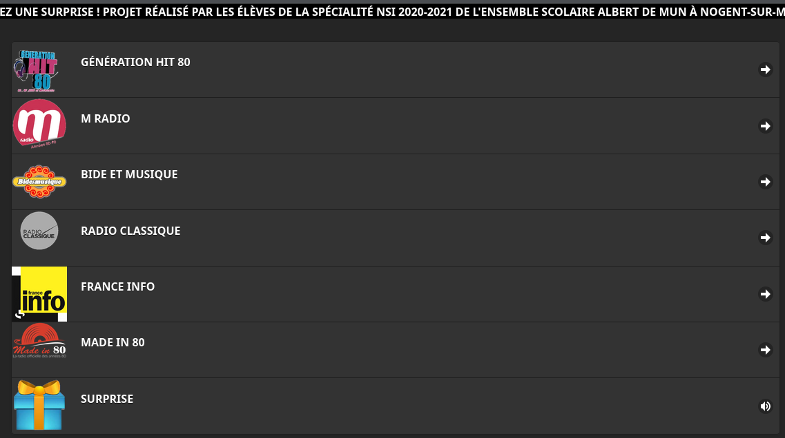

# radiodemo

Projet pour la classe de première NSI du Lycée Albert de Mun à Nogent-sur-Marne.
Ce dépot était automatiquement poussé en FTP vers le site web <a href="https://radiodemo.albertdemun.education/" target="_blank">https://radiodemo.albertdemun.education/</a> mais le domaine a été abondonné.

